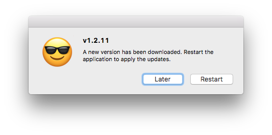

# update-electron-app

> A drop-in module that adds autoUpdating capabilities to Electron apps

Powered by the free and open-source [update.electronjs.org](https://update.electronjs.org) service.



## Requirements

Before using this module, make sure your Electron app meets these criteria:

- Your app runs on macOS or Windows
- Your app has a public GitHub repository
- Your builds are published to GitHub Releases
- Your builds are [code signed]

## Installation

```sh
npm i update-electron-app
```

## Usage

Drop this anywhere in your main process:

```js
require('update-electron-app')()
```

That's it! Here's what happens by default:

- Repository URL is found in your app's `package.json` file.
- Your app will check for updates at startup, then every ten minutes. This interval is [configurable](#API).
- No need to wait for your app's `ready` event; the module figures that out.
- If an update is found, it will automatically be downloaded in the background.
- When an update is finished downloading, a dialog is displayed allowing the user to restart the app now or later.

You can also specify custom options:

```js
require('update-electron-app')({
  repo: 'github-user/repo',
  updateInterval: '1 hour',
  logger: require('electron-log')
})
```

## API

### `update(options)`

Options:

- `repo` String (optional) - A GitHub repository in the format `owner/repo`. Defaults to your `package.json`'s `"repository"` field
- `host` String (optional) - Defaults to `https://update.electronjs.org`
- `updateInterval` String (optional) - How frequently to check for updates. Defaults to `10 minutes`. Minimum allowed interval is `5 minutes`.
- `logger` Object (optional) - A custom logger object that defines a `log` function. Defaults to `console`. See [electron-log](https://github.com/megahertz/electron-log), a module that aggregates logs from main and renderer processes into a single file.
- `notifyUser` Boolean (optional) - Defaults to `true`.  When enabled the user will be
  prompted to apply the update immediately after download.

## FAQ

#### What kinds of assets do I need to build?

For macOS, you'll need to build a `.zip` file and include it in your GitHub Release.
Use [electron-forge] or [electron-installer-zip] to package your app as a zip.

For Windows, you'll need to build a `.exe` file and include it in your GitHub Release.

#### Why is my app launching multiple times?

Windows apps have an update process that requires multiple application restarts.
You can use the [electron-squirrel-startup](https://github.com/mongodb-js/electron-squirrel-startup) module to improve this
behavior.

#### Can I use this module by uploading my private app's builds to a public GitHub repository?

Yes :)

## License

MIT

## See Also

If your app is packaged with `electron-builder`, you may not need this module.
Builder has its own built-in mechanism for updating apps. Find out more at
[electron.build/auto-update](https://www.electron.build/auto-update).

[electron-forge]: https://github.com/electron-userland/electron-forge
[electron-installer-zip]: https://github.com/mongodb-js/electron-installer-zip
[code signed]: https://github.com/electron/electron/blob/master/docs/tutorial/code-signing.md
